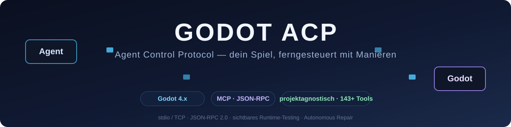

<div align="center">



# GODOT ACP

**Agent Control Protocol für Godot 4.x** — das Add-on, das dein Spiel für KI-Agenten fernbedienbar macht. Ohne dass das Add-on dabei etwas von deinem Spiel wissen will. Es ist wie eine Universalfernbedienung: funktioniert mit jedem Gerät, urteilt über keins.

[](https://godotengine.org)
[](https://modelcontextprotocol.io)
[](docs)
[](#lizenz)

*Ein Godot-Addon. 143+ Tools. Null Spielnamen im Quellcode.*

</div>

---

## Was ist das eigentlich?

GODOT ACP (Agent Control Protocol) ist ein **projektagnostisches Godot-4.x-Addon**,
das jedes laufende Spiel über das [Model Context Protocol](https://modelcontextprotocol.io)
für externe Agenten steuerbar macht — vom Klick auf den "Start"-Button bis zum
autonomen Bugfix mit Beweisfoto.

Die Philosophie in drei Sätzen: Das Add-on kennt Szenenbäume, Inputs, Screenshots
und Workspaces — aber **kein einziges Spiel**. Dein Spiel bleibt komplett bei dir;
was es anbieten will, meldet es über Konfiguration oder Duck-Typing-Konventionen.
Fehlt eine Konfiguration, antwortet das Add-on höflich "not configured" statt
stillschweigend ein fremdes Spiel anzunehmen. Sehr deutsche Angewohnheit, dieses
Gründlich-Nicht-Annehmen. Hier funktioniert sie.

> **Warum "ACP"?** Weil "MCP-Addon" etwa so beschreibend ist wie "Ding".
> ACP sagt, was es tut: ein **Kontrollprotokoll für Agenten**. Und weil
> Acronyme mit drei Buchstaben gut auf Banner passen.

---

## Use-Cases

### 🎮 1. KI-Agent spielt dein Spiel sichtbar durch
Ein Agent startet dein Spiel, bewegt die virtuelle Maus weich über den Bildschirm,
klickt Buttons anhand ihrer echten Labels, liest UI-Texte, prüft Screenshots — und
dokumentiert jeden Zug. Dein Spiel läuft dabei **sichtbar im Fenster**: du siehst
live zu, wie die KI spielt. Headless ist verboten; das ist Remote-Testing mit
Anwesenheitspflicht.

### 🔍 2. UI/UX-Audits ohne menschlichen Klick-Sklaven
`runtime_ux_scan` liefert alle sichtbaren Controls mit Text, Rect und Focus-Zustand.
`runtime_ux_find` findet Elemente nach Beschreibung, `runtime_ux_click` klickt sie.
Der Agent findet deinen kaputten Close-Button in 20 Durchläufen — ohne zu jammern,
dass das Häkchen im Fragebogen fehlt.

### 🐛 3. Bug-Reproduktion mit Freeze/Step
`runtime_freeze` pausiert den kompletten Spielbaum, `runtime_step_frames` tickt exakt
N Frames weiter, `runtime_click` queuet Inputs in die gefrorene Szene. Deterministische
Reproduktion von Timing-Bugs — endlich, nach Jahren von "kannst du das nochmal machen,
ich schaue nicht richtig hin".

### 🤖 4. Autonomer Repair-Loop (Self-Healing)
Der Agent legt einen journaled Workspace an, importiert Dateien, patcht mit
Fail-closed Single-Occurrence-Patches, exportiert **gated** zurück nach `res://`
(nur mit `apply=true`, nur mit Preimage-Journal), läuft Contract-Chains und
rollbackt hash-basiert, wenn der Beweis nicht passt. Jeder Run erzeugt einen
Evidence-Trace. Es ist wie ein Praktikant, der erst den Kaffee holt, dann den
Patch, und am Ende alle Belege selbst abheftet.

### 📸 5. Vision & OCR-Pipeline
Screenshots landen als lokale Artefakte (TTL 45 s, niemals Base64 durchs MCP),
ein Python-Worker liest sie von Disk, OCR läuft über pytesseract + Tesseract-CLI.
Bei unerwarteten Tool-Antworten hängt der Server automatisch `visual_evidence`
an — Fire-and-forget, die Aktion blockiert nie. Der Agent darf nicht raten.
Sieht es trotzdem jemand machen, gibt's zumindest ein Foto davon.

### 📊 6. Performance- & Engine-Diagnostik
FPS, Draw-Calls, Objekt-Counts, Memory, Frame-Timing, ClassDB, Resource-UIDs —
alles als Tool abfragbar, auch mitten im sichtbaren Spiel (der Server tickt mit
`PROCESS_MODE_ALWAYS` sogar im Pause-Menü weiter. Ja, auch da. Besonders da.).

### 🧪 7. Chain-Testing mit echten Beweisen
Versionierte Chain-Manifeste (`mcp_chains/*.json`): Preconditions → Atome →
Assertions → Evidenz. Ein "PASS" ist nur echt, wenn die Kette wirklich so lief —
vor Ausführung wird validiert, dass jeder Schritt atomar, bounded und mit
Postcondition daherkommt. Fake-Testing wird beim Validieren erschossen. Metaphorisch.

### 🗂 8. Cross-Session-Wissen
Der Playthrough-Agent archiviert funktionierende Aktionen (JSONL + Frames + Presets),
damit der nächste Agent bei Schritt 1 weitermacht statt bei null. Deine Agenten
sammeln Erfahrung. Deine Toasts bleiben unberührt.

---

## Installation

### Schritt 1: Add-on ins Projekt

Den `mcp/`-Ordner dieses Repos als `addons/mcp/` in dein Godot-4.x-Projekt legen
(Kopie, Submodule oder Release-Zip — der Pfad `addons/mcp` ist der einzig
erwartete Well-known-Pfad):

```bash
git clone <dieses-repo> /tmp/godot-acp
cp -r /tmp/godot-acp/mcp <dein-projekt>/addons/mcp
```

### Schritt 2: Plugin aktivieren

**Project Settings → Plugins → GODOT ACP → Enable.**

Das Add-on registriert beim ersten Editor-Boot idempotent:
- die Autoloads `McpRuntime` + `McpProjectAdapter` (inert ohne `--mcp`-Flag), und
- leere `application/mcp/*`-Settings (bewusst leer — siehe [ENTKOPPLUNG.md](ENTKOPPLUNG.md)).

### Schritt 3: Host-Projekt konfigurieren (optional, nach Bedarf)

```ini
[application]
; Sichtbares E2E: deine Start-Szene + Labels (ohne diese: SKIP statt Absturz)
mcp/main_menu_scene="res://scenes/start/start.tscn"
mcp/e2e_start_label="SPIEL STARTEN"
mcp/e2e_world_scene="world"

; State-Brücke (optional): dein GameState als Autoload wird automatisch gefunden
mcp/game_state_node="/root/GameState"

; Entity-Brücke (optional): Node oder Gruppe mit get_id()/get_faction()-Objekten
mcp/planets_group="planets"

; Eigenes Preflight-Skript für den preflight_constraint-Chain-Schritt
mcp/preflight_script="res://tests/preflight.gd"
```

Die komplette Setting-Tabelle mit Degradierungs-Verhalten: [ENTKOPPLUNG.md §3](ENTKOPPLUNG.md).

### Schritt 4: Spiel mit MCP starten

```bash
$GODOT_BIN --path . -- --mcp --mcp-port 9090
```

Oder komfortabel über den **QA-Live-Dock** im Editor: Play-Goal wählen
(`player`/`qa`/`dev`), auf „Spiel starten +MCP" klicken — der Dock startet das
Spiel als separaten Prozess, der Runtime-Server bootet im echten Spiel-SceneTree,
und der Dock verbindet sich von selbst. Eine Taste, null Konfiguration.

### Schritt 5: Externen Client anbinden

`.mcp.json` ins Projekt-Root (Vorlage liegt bei) und den **absoluten** Pfad zum
cwd-immunen Wrapper eintragen:

```json
{
  "mcpServers": {
    "godot-acp": {
      "command": "<ABSOLUTER_PROJEKTPFAD>/mcp_bridge.cmd",
      "env": { "MCP_HOST": "127.0.0.1", "MCP_PORT": "9090" }
    }
  }
}
```

> **Wichtig:** absoluter Pfad, weil externe MCP-Clients gerne ihr eigenes cwd
> mitbringen — relative Pfade lösen dann gegen `C:\Users\…\addons\...` auf und
> der Server startet nie. Wir nennen das "bekanntes Verhalten", nicht "Bug".
> (Wrapper leitet den Bridge-Pfad über `%~dp0` ab — cwd des Clients egal.)

### Schritt 6: Verifizieren

```bash
# Status abfragen:
node addons/mcp/client/playthroughs/atomic/mcp_player_atom.js runtime_mcp_status '{}'

# Persistente Session für viele atomare Aktionen:
node addons/mcp/client/playthroughs/atomic/atomic_session.js
```

### Schritt 7: Commit-Hooks aktivieren (für Contributor)

```bash
git config core.hooksPath testing/hooks
```

Das aktiviert das Commit-Gate (`pre-commit`) und den KI-Signaturen-Filter
(`commit-msg`) — Details in [agent.md §2.6](agent.md).

---

## Architektur in 20 Sekunden

```text
Agent ────────┐
              │
Human ────────┼→ BACKEND (Autorität, backend/server.mjs)
              │     ├─ Target-Registry · Agent-Registry
React ────────┤     ├─ Command-Bus (eine Zustandsmaschine, Origins: human/agent/system/qa)
Ink ──────────┘     ├─ Blockliste (Entities) · Freigaben · Ziele
   │  SSE: /api/events (derselbe Strom für beide Frontends)
   │                └─ append-only JSONL (State immer daraus ableitbar)
   ▼
Godot-Adapter (das Addon: runtime/ editor/ vision/ ux/ testing/ autonomy/)
   │  meldet nur: godot.connected/disconnected/state_changed/event/command_result
   ▼
Godot (Spiel, MCP-Tools :9090)
```

**Die Rollenverteilung:** Das **Backend ist die Autorität UND der Orchestrator** —
Zustände, Befehle, Blockaden, Freigaben, Historie *und die selbstständige
Arbeitsorganisation* leben in `backend/` und laufen ohne Godot. Der Orchestrator
beobachtet endet nicht, packt Work-Orders mit echter Baseline und triggert
**nur bei echten Anomalien** (FAILED/TIMEOUT/isError) eine atomare
Analyse-Kette — generisch aus den echten Ziel-Capabilities (Vision/OCR/Audio/
Debug/Logs), nicht aus einer Hardcode-Liste. Das Godot-ACP ist
**Adapter/Execution-Layer**: Es enthält die wertvolle Godot-Fähigkeit
(Runtime-/Input-Tools, Vision, UX, E2E, Autonomy-Workspace, Chains,
Run-Trace), besitzt aber keine Systemzustände mehr. Der Contract-Test
(`fake_godot/`) beweist, dass das Backend **vollständig ohne echte
Godot-Instanz** funktioniert; die reale Strecke wurde zusätzlich mit echtem
Godot 4.7.2 geprüft (echter UX-Scan mit Controls, echter Pause-ACK,
Blockliste, automatische Anomalie-Analyse mit echten Godot-Tools,
Reconnect, Persistenz-Replay). Einzelheiten: [backend/README.md](backend/README.md).

> **Arbeitsmodell (harte Regel):** Tasks laufen als **atomare
> Ausführungsreihen** im sichtbaren Spielfenster — `backend.run_sequence`
> abgeben, das Backend baut die Reihenfolge und ergänzt smooth Maus-Ansätze
> **automatisch**; Ausführung asynchron, Fortschritt per `sequence.progress`.
> **Bootstrap für Agenten (ohne Code-Lektüre):** `backend.onboard` liefert
> Vertrag, Worker-Loop (`get_work → atomarer Call → observe → claim_work`),
> Human-Control-Regel und nächste Schritte in einem Objekt. Zusätzlich gilt:
> Nach dem Verbinden **zuerst** `runtime_mcp_capabilities` aufrufen — das Tool
> liefert Projektkonfig, Capabilities, die vorgeschriebenen Loops (atomare
> Kette!) und Transport.

---

## Die drei Regeln (kurz, weil sie in drei Dokumenten lang stehen)

1. **Kein Spielvokabular im Addon-Kern** — der Coppling-Check im Commit-Gate
   wacht darüber ([ENTKOPPLUNG.md §6](ENTKOPPLUNG.md)).
2. **Leere Settings statt Fremd-Defaults** — ohne Konfiguration degradiert das
   Add-on sauber (`SKIP`/`BLOCKED`/`not configured`), nie falsches Verhalten.
3. **Eine zentrale Config-Schicht** — `McpAddonConfig` liest als EINZIGES Modul
   die `application/mcp/*`-Settings. Ein Ort. Kein Wildwuchs.

---

## Dokumentation

| Dokument | Inhalt |
|---|---|
| [MCP_INDEX.md](MCP_INDEX.md) | Architektur & komplette Tool-Liste |
| [ENTKOPPLUNG.md](ENTKOPPLUNG.md) | Addon↔Host-Vertrag & Config-Zentralisierung |
| [agent.md](agent.md) | Commit-Governance & Ton-Vorgabe für Agenten |
| [PERSISTENCE.md](PERSISTENCE.md) | Was wohin persistiert (TTLs, Retention) |
| [AGENTS.md](AGENTS.md) | Test-Doktrin für MCP-Tests |
| [AGENT_WORKFLOW.md](AGENT_WORKFLOW.md) | 6-Schritte-Agent-Loop & Repair-Loop |
| [PLAYTEST_HANDOFF.md](PLAYTEST_HANDOFF.md) | Spieler-Vertrag (player/qa/dev-Profile) |
| [BESTANDSAUFNAHME.md](BESTANDSAUFNAHME.md) | Modul-/Tool-Bilanz & Lücken-Register |
| [backend/README.md](backend/README.md) | Backend-Autorität + Orchestrator: Registries, Command-Bus, Anomalie-Analyse, Contract-Test, reale Strecke |
| [ROADMAP.md](ROADMAP.md) | Wo die Reise hingeht |

---

## Lizenz

Noch nicht final gewählt (TBD) — Vorschlag: MIT. Bis dahin gilt: Copyright liegt
beim Projekt-Owner, Nutzung auf eigene Gefahr und mit gutem Humor.

---

<div align="center">
<sub>GODOT ACP — gebaut für Agenten, die nicht raten, und Menschen, die zusehen.</sub>
</div>
